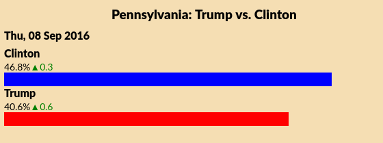
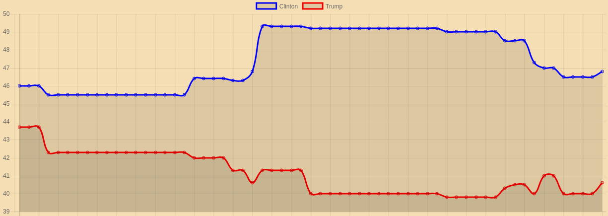

# Pol.js
Embed the most up to date political polling data and charts in your site with pol.js.

### [Live Demo with React.js](http://poljs-react-demo.herokuapp.com/)

## About:
Pol.js is a synthetic API that retrieves up to the minute polling data from Real Clear Politics and embeds it in your website hassle-free.

As Real Clear Politics does not provide a formal API, but makes their data public, Pol.js fills that gap by providing a synthetic API that mimics the functionality of a public API.

A Pol.js call to ```Pol.presidentialPoll(state)``` makes an AJAX request to the URL where the RCP polling data for that state 'lives'.

RCP polling data URLs are constructed in the following manner: ```http://www.realclearpolitics.com/epolls/json/XXXX_historical.js``` where the ```X```s represent the unique four digit number assigned to the poll. These values are hard coded into Pol.js for lookup by state or number.

As RCP's data is wrapped in a callback, Pol.js utilizes a JSONP callback to extract the data.

```javascript
$.ajax(
  {
    url: rcpURL + pollID.toString() + historical,
    dataType: 'jsonp',
    jsonpCallback: 'return_json',
    success: (someData) => {
      callBack(someData);
    },
    error: () => {
      //try again if there's a problem
      _make_request(pollID, callBack);
    }
  });
```

Pol.js can render the most recent data as a bar graph.



Or as a historical canvas line chart




##Quick Start:

Ensure that you include jquery somewhere.
In your html body, include:
```html
<div class="polls" id="polls-root">

</div>
```

###Embedding Charts

Pol.js uses [Chart.js](http://www.chartjs.org/) to draw charts. It is included as a dependency in the npm package.

In your html file, create a canvas element with id 'canvas':
```html
<canvas id="canvas" width="600" height="300"></canvas>
```
call pollChart with your desired data passed in as a string:
```javascript
  Pol.pollChart('four-way-national');
```
If you want to constrain the size of your chart, place it in a div with a fixed size:
```html
<div class="canvas-container" style: 'width: 600px; height: 300px;'>
  <canvas id="canvas" width="600" height="300"></canvas>
</div>
```
It's that easy!


##Documentation:
```JavaScript
  Pol.presidentialPoll(state = 'national', format = 'html')
```
Displays presidential polling as html or json for the specified state. If no state is specified, displays national polling data. If no format is specified, renders HTML to
```html
<div id "polls-root">
```
Note that you can specifiy a specific RCP poll ID by passing in a poll ID number as the state parameter, so
```JavaScript
Pol.presidentialPoll(5542);
//is the same as:
presidentialPoll('virginia', 'html');
```
You can get the 4 way race polling with:
```JavaScript
Pol.presidentialPoll('four-way-national');
```

###Senate Races

2016 senate races are also available with Pol.js.

```JavaScript
Pol.senatePoll('Ohio')
Pol.senateChart('Ohio')
```
